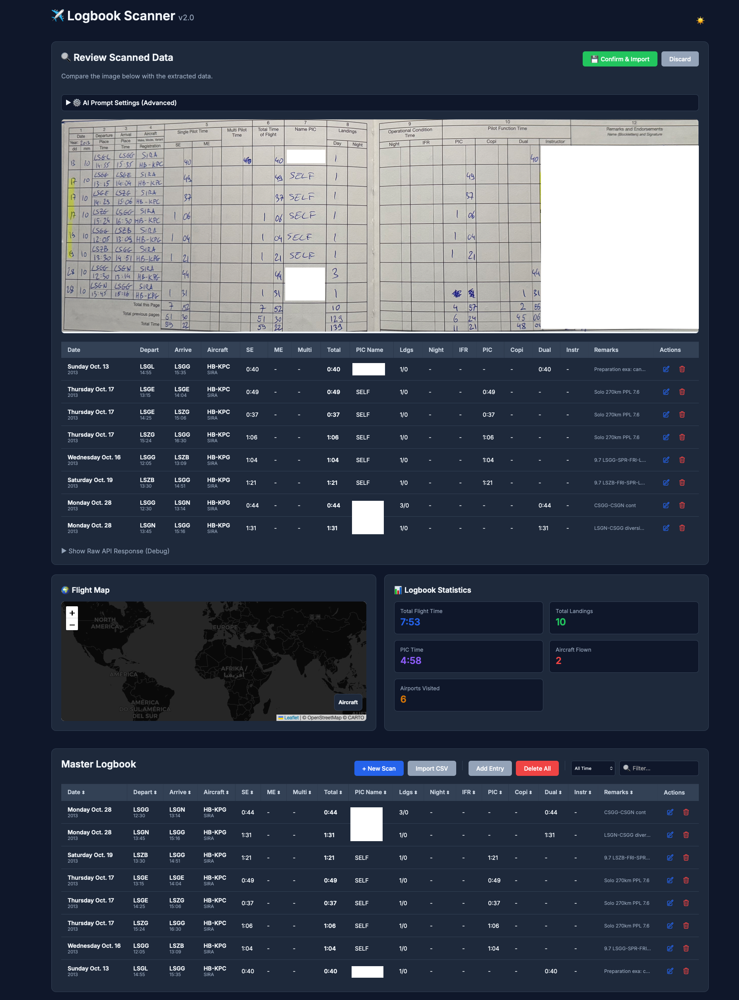

# Logbook Scanner Pro ✈️

A powerful AI-powered logbook scanner and management tool for pilots. Digitize your paper logbooks with ease, visualize your flight history, and get detailed statistics.



## Features

- **AI-Powered OCR**: Upload images of your logbook pages and let our advanced AI extract flight data automatically.
- **Flight Map**: Visualize your flights on an interactive map.
- **Statistics**: Get detailed stats on flight times, landings, aircraft flown, and more.
- **Manual Entry**: Add and edit entries manually with a user-friendly interface.
- **CSV Import**: Import data from ForeFlight and other digital logbooks.
- **Search & Filter**: Easily search and filter your logbook entries.
- **Dark Mode**: Sleek dark mode for night owls.

## Installation & Running

### Prerequisites
- Python 3.14+
- `uv` or `pip`

### Setup

1. **Clone the repository**
   ```bash
   git clone <repository-url>
   cd logbook
   ```

2. **Create a virtual environment and install dependencies**
   ```bash
   python -m venv venv
   source venv/bin/activate
   pip install -r requirements.txt
   ```

3. **Install Playwright browsers (for UI tests)**
   ```bash
   playwright install
   ```

4. **Run the application**
   ```bash
   make run
   ```
   The application will be available at `http://localhost:8000`.

## Tech Stack

- **Backend**: FastAPI, SQLModel (SQLite)
- **Frontend**: HTML5, Vanilla JS, CSS (with Cropper.js and Leaflet)
- **AI/OCR**: Google Gemini Pro Vision / GPT-4 Vision (Configurable)
- **Testing**: Pytest, Playwright

## License

MIT
